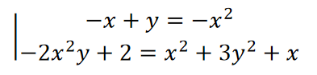
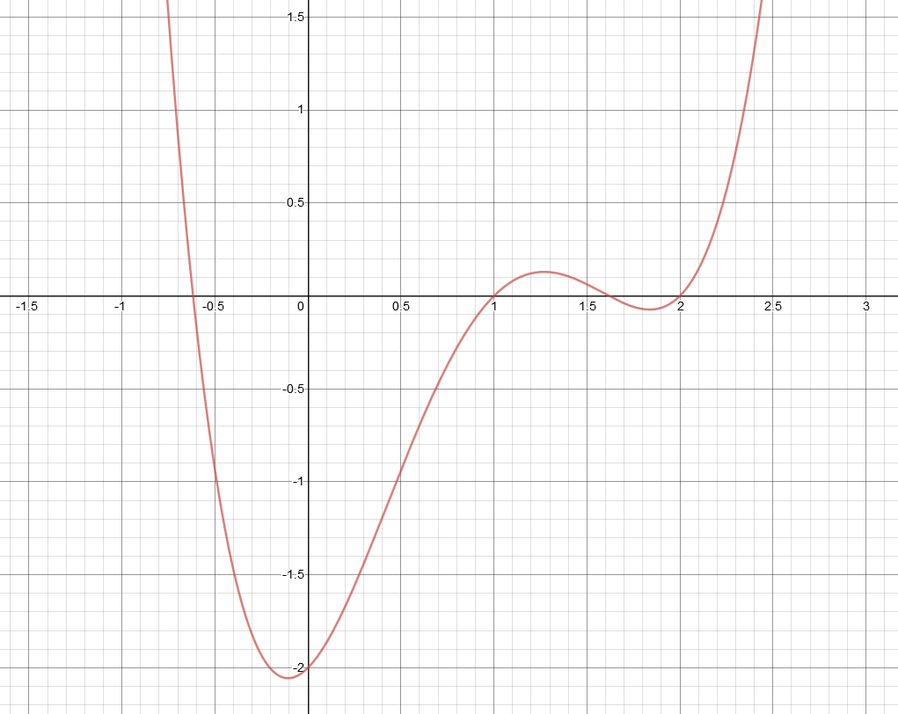
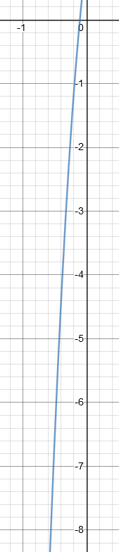
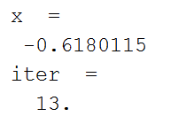
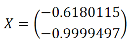

# bisection-numerical-method
Finding a solution of a system of equations using the bisection root-finding algorithm.

## Задача:
Дадена е системата:



С точност до 0.0001 намерете едно решение на системата с помощта на
подходящ числен метод. Можете да използвате:

1.  метода на Нютон за нелинейна система;

2.  метода на последователните приближения за нелинейна система;

3.  ***свеждане на системата до едно уравнение и прилагане към
    полученото уравнение на някои от числените методи за нелинейно
    уравнение.***

Курсовата работа задължително следва да съдържа:

-   Кратко теоретично описание на метода, който сте избрали;

-   Математическа обосновка, че приложеният метод е сходящ в областта
    (интервала), където сте избрали да търсите решението;

-   Код на използваната програма (Matlab, **Scilab** или Maple).

## Решение:
При избор на подход **c)** за решаване на задачата, системата трябва да се сведе до едно уравнение. За тази цел от първото уравнение изразяваме <code>*y* = *x* − *x*<sup>2</sup></code>.

След това заместваме във второто уравнение и извършваме необходимите
операции за да го приведем във вида *f*(*x*) = 0:

<code>− 2*x*<sup>2</sup>(*x*−*x*<sup>2</sup>) + 2 = *x*<sup>2</sup> + 3(*x* − *x*<sup>2</sup>)<sup>2</sup> + *x* </code>

<code> − 2*x*<sup>3</sup> + 2*x*<sup>4</sup> + 2 = *x*<sup>2</sup> + 3(*x*<sup>2</sup>−2*x*<sup>3</sup>+*x*<sup>4</sup>) + *x*</code>

<code>2*x*<sup>4</sup> − 2*x*<sup>3</sup> + 2 = *x*<sup>2</sup> + 3*x*<sup>2</sup> − 6*x*<sup>3</sup> + 3*x*<sup>4</sup> + *x*</code>

<code> 2*x*<sup>4</sup> − 3*x*<sup>4</sup> − 2*x*<sup>3</sup> + 6*x*<sup>3</sup> − *x*<sup>2</sup> − 3*x*<sup>2</sup> − *x* + 2 = 0 </code>

<code>− *x*<sup>4</sup> + 4*x*<sup>3</sup> − 4*x*<sup>2</sup> − *x* + 2 = 0\|.(−1) </code>

<code> *x*<sup>4</sup> − 4*x*<sup>3</sup> + 4*x*<sup>2</sup> + *x* − 2 = 0</code>

Така получаваме:

<code> *f*(*x*) : *x*<sup>4</sup> − 4*x*<sup>3</sup> + 4*x*<sup>2</sup> + *x* − 2 = 0</code>

За намиране на корена ще използваме **метода на разполовяването (метод
на бисекцията)**. Това е най-простия метод за уточняване на корен в
интервала \[*a*, *b*\], но е сравнително бавно сходящ.

Методът се състои в разделянето на интервала на два равни подинтервала и
избиране за нов интервал този, в краищата на който функцията има
различни знаци. Тази операция се повтаря докато текущия интервал стане
по-малък от зададената грешка.

За да бъде сходим метода на разполовяването е необходимо да са изпълнени
следните условия:

-   Функцията трябва да има различни знаци в двата края на интервала,
    т.е. <code>f(a)f(b) < 0</code>. Така гарантираме, че в интервала има поне един
    корен.

-   Коренът трябва да е единствен в дадения интервал.

Графиката на **f(x)** изглежда по следния начин:



Видно е, че един от корените е разположен в близост до - 0.5. Затова
за интервал избираме:

<code>x &isin; [-1,-0.5]</code>

Нека проверим дали този интервал отговаря на условията за сходимост:

<code>f(-1) = (-1)<sup>4</sup> - 4(-1)<sup>3</sup> + 4(-1)<sup>2</sup> + (-1) - 2 = 1 + 4 + 4 - 1 - 2 = 6 > 0</code>

<code>f(-0.5) = (-0.5)<sup>4</sup> - 4(-0.5)<sup>3</sup> + 4(-0.5)<sup>2</sup> + (-0.5) - 2 = 0.0625 + 0.5 + 1 - 0.5 - 2 = -0.9375 < 0</code>
  
Следователно <code>𝑓(𝑎)𝑓(𝑏) = 𝑓(−1)𝑓(−0.5) < 0</code> и в интервала има поне един корен.
  
Фактът, че коренът е един,може ясно да бъде потвърден от графиката. За допълнително потвърждение нека разгледаме и първата производна на функцията: 

<code>f'(x) = 4x<sup>3</sup> - 12x<sup>2</sup> + 8x + 1</code>
  


Производната <code>*f*′(*x*) &lt; 0</code> за всяко <code>x ∈ [−1,−0.5]</code>. От това следва, че *f*(*x*) е монотонна в интервала и следователно пресича абсцисата само веднъж. Така потвърждаваме, че коренът в интервала е единствен.

Вече може да пристъпим към същинското решение на задачата. За целта ще използвам софтуерния инструмент Scilab. Кодът изглежда по следния начин:

```sce
// Изчистване на конзолата и на заредените в паметта променливи.
clc; clear;

// Показване на стойност в конзолата, в случай, че не сме поставили ";" в края.
mode(0);

// Дефиниране на променливи.
a = -1; // Лява граница на интервала.
b = -0.5; // Дясна граница на интервала. 
err = 0.0001; // Грешка (целева точност).
iter = 0; // Брояч.

// Дефиниране на функцията f(x).
function z=f(x)
    z = x^4-4*x^3+4*x^2+x-2;
endfunction

fa = f(a); // Стойност на ф-ята в левия край на интервала.

// Цикъл на метода.
while b-a > err // Докато текущия интервал е по-голям от грешката.
    iter = iter+1; // Инкрементиране на брояча.
    mid = (a+b)/2; // Среда на интервала.
    fmid = f(mid); // Стойността на ф-ята в средата на интервала.
    
    // Ако ф-ята има различни знаци в левия край и в средата на интервала:
    if fa * fmid < 0
        b = mid; // Коренът се намира в левия подинтервал. Затова променяме дясната граница на средата на интервала.
    else // В противен случай:
        a = mid; // Коренът се намира в десния подинтервал. Затова променяме лявата граница на средата на интервала.
        fa = fmid; //Записваме в променливата fa, участваща в проверката, стойността на функцията в новата лява граница.
    end
end

// След достигане до необходимата точност намираме средата на последния интервал, което е и търсеното от нас решение.
x=(a+b)/2
iter // Не слагаме ";" в края, за да изведем на конзолата отговора и броя итерации.
```

След изпълняване на скрипта получаваме следния резултат:



При точност 0.0001 стигаме до резултата *x* = −0.6180115 след 13 итерации.

Разбира се, не трябва да забравяме, че до *f*(*x*) стигнахме след свеждане на система от две нелинейни уравнения. Затова трябва да изчислим и другата променлива:

<code>y = x − x<sup>2</sup> = −0.6180115 − (−0.6180115)<sup>2</sup> = −0.9999497</code>

С това задачата е решена:




